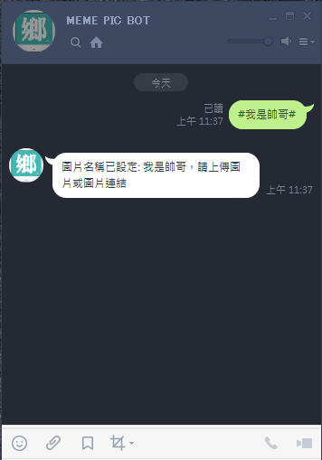

# Meme Pic Line Bot

---------------------------------------

# 技術介紹

## 使用到的技術

* Python + Flask + SQLAlchemy
* GCP - cloud function

## 程式設計

1. 在機器人所在的聊天室有人講話時便會透過 webhook 觸發此程式，並會依照以下邏輯開始動作:
    * new 出新 bot 實體
    * new 出新 chat 實體，並去資料庫撈資料
     (如該使用者使用權限、該聊天室設定、機器人設定等等)
    * 將 chat 餵給 bot，bot 依據該 chat 的設定檔決定該怎麼做事
    * ***將所有的 skill class 與 mode class 的方法輪巡過一遍，執行所有不為 private 的功能
    而是否符合執行的條件則在各 skill、mode 中判斷
    如此能做到如果新增新的機器人技能或是新的行為模式時
    可以不用在主邏輯中增加 if else 去判斷要做什麼而是獨立判斷進而方便後續維護***
2. 程式進入點在 [main.py](https://github.com/wolke1007/LineBot-MemePicBot/blob/master/main.py) (Controller)
3. 每筆獨立的聊天訊息在傳進來時會被包裝成自定義的 [chat class](https://github.com/wolke1007/LineBot-MemePicBot/blob/master/models/chat.py)，並設定其 metadata 例如:
    * 該使用者是否已被 banned 所以機器人不用理會該使用者
    * 該聊天室的設定(回話長度、是否為不回話的靜音模式等)
    * 機器人當下是否設定為要接收新圖片
4. 機器人所有設定皆寫在 [bot](https://github.com/wolke1007/LineBot-MemePicBot/tree/master/models/bot) 資料夾中方便維護
    * [bot](https://github.com/wolke1007/LineBot-MemePicBot/blob/master/models/bot/bot.py) 機器人功能進入點
    * [skill](https://github.com/wolke1007/LineBot-MemePicBot/blob/master/models/bot/skill.py) 如有新功能則新增在這邊，並用非 private 方法的方式撰寫就會被執行
    * [mode](https://github.com/wolke1007/LineBot-MemePicBot/blob/master/models/bot/mode.py) 回不回話、是否只回該群組所上傳的圖 等回話設定在這邊維護

---------------------------------------

此 Line Bot 可設定關鍵字與圖片，若聊天中提及該關鍵字會回覆的所設定之圖片  
[Youtube 介紹影片播放清單請點此](https://www.youtube.com/watch?v=eaLdnCgfywE&list=PLG-U6LloaLMsfdx8MqBBefKgCFYVfavAf)  
(也可觀看下方功能介紹影片)  
若想試玩此 BOT 請搜尋 Line ID "@srh5401g"  
或掃描以下 QR Code 加入好友  


---------------------------------------
# 功能介紹
* 讓使用者設定關鍵字與圖片組合
  使機器人根據聊天中的關鍵字回覆已設定的圖片給該聊天群組 [影片](https://www.youtube.com/embed/eaLdnCgfywE)
* 列出目前已設定過的關鍵字刪除已設定過的關鍵字 [影片](https://www.youtube.com/embed/Womg857wDws)
* 設定機器人在該聊天群組的回圖行為:
  不回圖 or 隨機回所有群組創的圖(預設) or 只回該群組上傳的圖 
* 設定機器人在該聊天群組裡關鍵字符合超過(大於等於)幾字才回話，可以設為 2~15 [影片](https://www.youtube.com/embed/xT4adktk3C8)
  > e.g. trigger_chat = 3  
  > "帥哥" -> 不會被觸發  
  > "我是帥哥" -> 會被觸發  
---------------------------------------

# 使用教學
## 一般使用
##### 1. 設定圖片名稱，例如 #我是帥哥#
  

    1-1. 圖片字數有限制，空白或是特殊符號皆算數
    1-2. 設定同圖片名稱則會蓋掉前面上傳的
    1-3. 如果設定多次名字，以最後一個命名為主
##### 2. 上傳圖片或是貼上圖片的 URL，系統會回傳上傳成功
  
  

    2-1. 若上傳URL則必須為 http 開頭(https亦可) .jpg .jpeg .gif .png 結尾（其餘副檔名不支援)

##### 3. 聊天時提到設定的圖片名稱便會觸發貼圖
  

    3-1. 若命名上有重疊，則會觸發命中字數較多的那個 
        e.g. 圖片1: 帥哥
             圖片2: 我是帥哥
             聊天內容: 你在問我我是帥哥嗎?
             將會回覆圖片2，因為命中字數較長

## 聊天室設定
#### 設定機器人在該聊天群組的回圖行為
##### `--mode`
返回當前聊天群組的設定  
  

##### `--mode chat_mode 0~2` 
* 0 = 不回圖
* 1 = 隨機回所有群組創的圖(此為預設)
* 2 = 只回該群組上傳的圖
(只回該群組上傳的圖，當不想看到其他群組設定的圖片時可使用  
畢竟有時別人的梗我們不一定懂，或是有人放廣告之類的騷擾訊息)  
#### 設定機器人在該聊天群組裡關鍵字符合超過(大於等於)幾字才回話
##### `--mode trigger_chat 2~15`
```
e.g. trigger_chat = 3
     "帥哥" -> 不會被觸發
     "我是帥哥" -> 會被觸發
```
## 其他功能
#### 列出目前已設定過的關鍵字
##### `--list` 
  

#### 刪除已設定過的關鍵字
##### `--delete <圖片名稱>` 
```
e.g. --delete 我是帥哥
```
    1. 只能刪除自己的上傳的圖片(此部分可議)  
    2. 只能刪除於該聊天室所創的圖片  

---------------------------------------

## 已知問題(或淺在問題)
1. 目前有潛在的效能問題，因為每句對話皆會去撈 DB 內所有 pic_name 來判斷是否有在裡面  
1-1. DB 連線數會是個問題  
1-2. 當圖片多的時候都撈整個 table 回來變得不切實際  
2. 所有 None group 對話的 mode 設定會算在同一個(也就是每個私底下敲機器人的對話 mode 設定會共用)  
3. --list 的表格中若字串超過一定長度會爆框，或字串重疊，中文英文的顯示長度也不一樣需要考慮進去

## 待實作 Feature
* meme pic 製作功能，效果預期跟 meme gen 一樣，有 open source code 可以參考
  * 功能詳見 https://memegen.link/
  * source code https://github.com/jacebrowning/memegen
* 讓 user report 不好的圖片機制
  * 預計是讓使用者回報哪句話出現不好的圖片，甚至可以附註為什麼
  * 管理員能夠透過對話獲得回報的內容並人工檢查圖片並刪除
* 管理員功能
    * 管理員登入/登出功能(可以研究能不能用 3rd 的 auth 機制之類的)
    * banned 帳號
    * 檢視使用者舉報有問題的內容
    * 使用最高權限直接無條件刪除圖片

## 備註
* 建議在 Line 設定將「自動下載照片」取消打勾
   設定 > 照片。影片 > 自動下載照片
